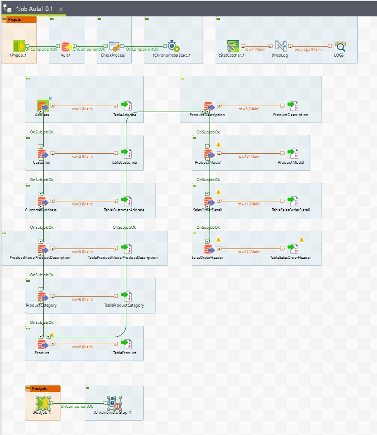

# Documentacao referente a criacao do job de ETL via Talend e criacao do docker para execucao do mesmo

## O job de extracao do talend, conectará no banco de dados e extrair as tabelas para o diretorio /home/airflow/airflow/dataset/, onde organizaremos nos datasets

